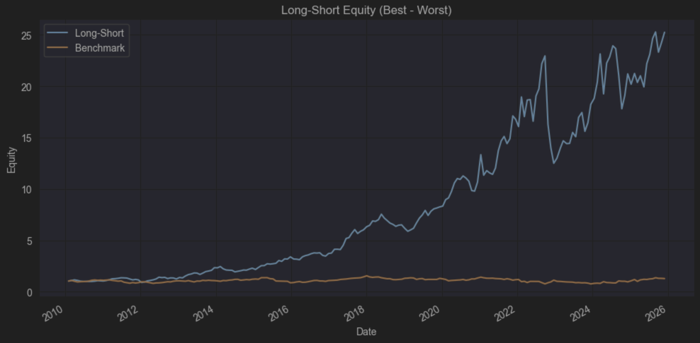
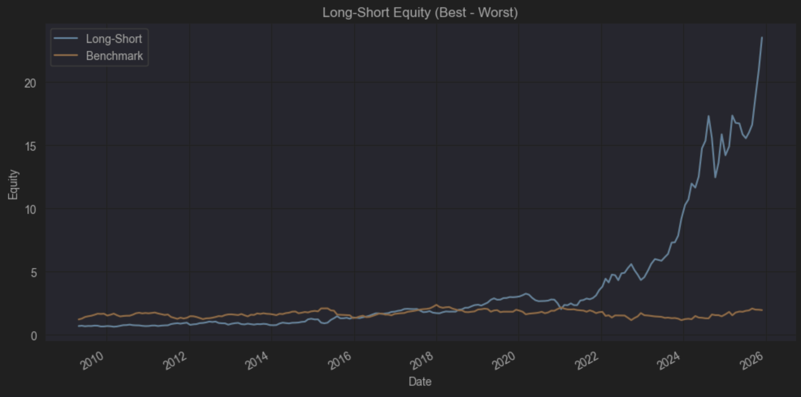
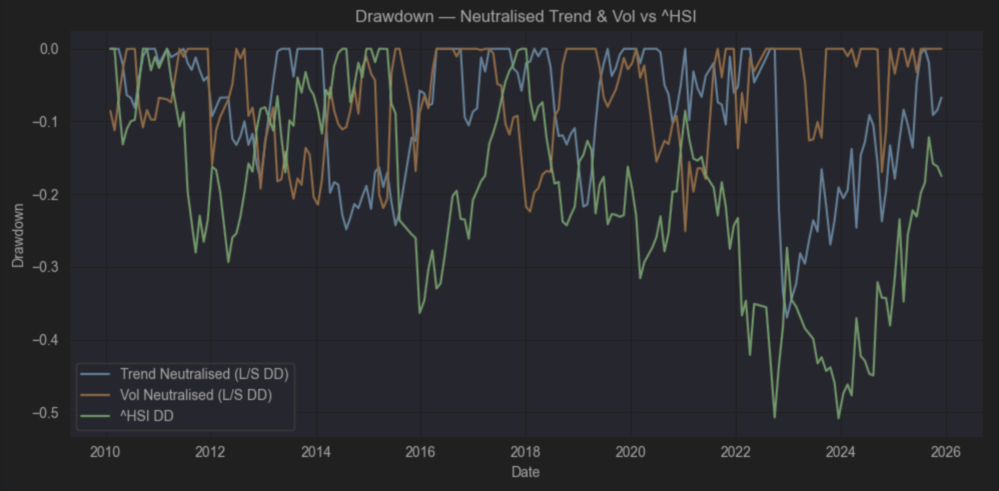
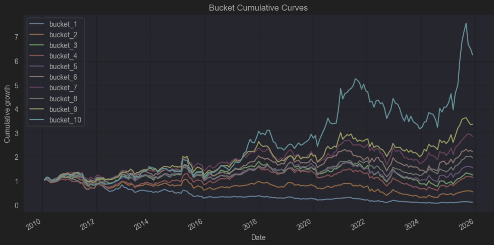
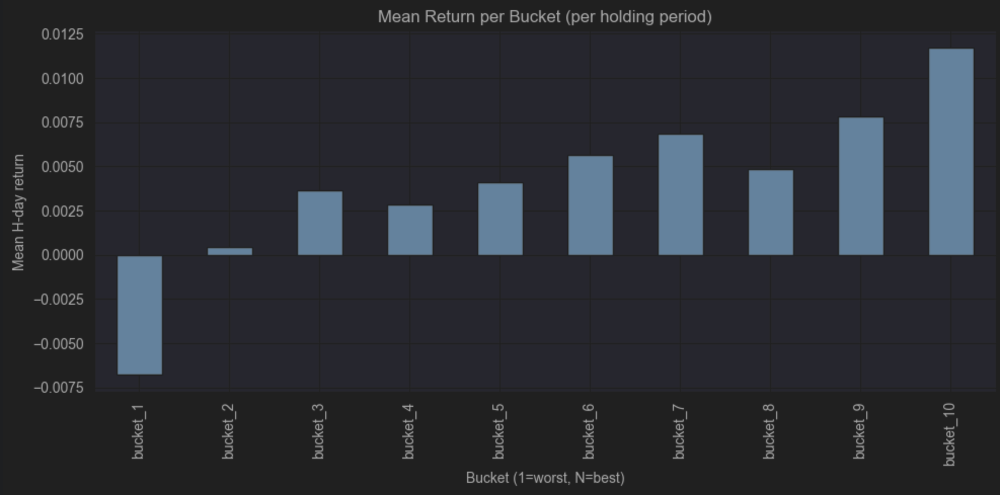
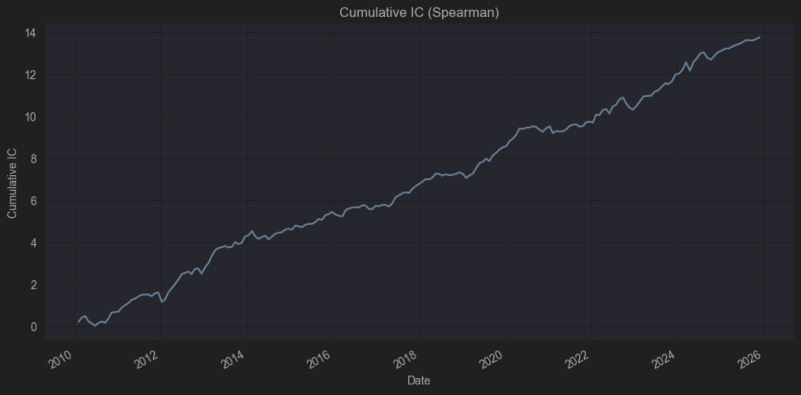
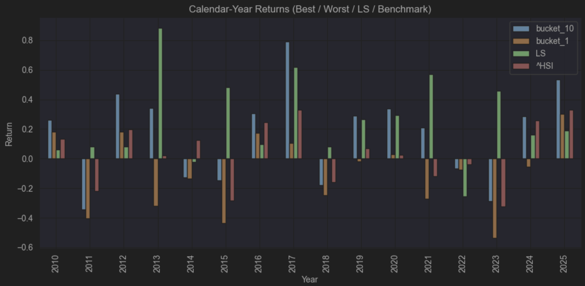

# HSCI Cross-Sectional Factor Research (Trend / Volatility / Liquidity)
**Universe:** HSCI constituents with eligibility filters (point-in-time):  
- Market cap > **HKD 1bn** (approximated)  
- 1-month average price > **HKD 1**  
- Stock is in **HSCI universe** at the time  
Unavailable / suspended / missing-data stocks are treated as **non-tradable** and excluded. “Unknown sector” names are primarily suspended stocks and therefore are typically excluded by the tradability filter.

**Objective:** Pure **alpha research** on Hong Kong equities via cross-sectional signals. No stop loss, no additional risk management overlays, and no explicit exposure constraints beyond the eligibility screen.

---

## 1) Data & Sources
- **OHLCV, Market Cap (approximated), Sector:** `yfinance`  
- **HSCI component history (point-in-time membership):** Hang Seng Index website data  
- **Note on market cap:** used as an **approximated** proxy for size; all size-related eligibility and neutralisation are interpreted under this approximation.

---

## 2) Portfolio Construction & Backtest Setup
- **Signal type:** cross-sectional ranking signals (three factor directions)  
- **Rebalance / holding:** every **20 trading days** (monthly cadence), `entry_mode = next_close`  
- **Long/Short construction:** **Long best 10%** / **Short worst 10%** (equal-weight within legs unless otherwise specified by implementation)  
- **Costs:** trading fees included (per your backtest cost model)  
- **Benchmark:** **^HSI** (Hang Seng Index)

---

## 3) Factor Directions (Formula Withheld)
To keep this report publicly shareable, the exact factor formulae are withheld. Factor directions align with common implementations described in **CICC Quant Handbook (HK)**:
1. **Trend (price trend):** captures the strength/stability of price trend formation.
2. **Volatility (high–low volatility structure):** captures volatility regime/structure differences derived from high–low dynamics.
3. **Liquidity (Amihud proxy):** captures price-impact / liquidity characteristics consistent with Amihud-style illiquidity measures.

---

## 4) Neutralisation Framework (Sector + Size)
To separate “pure stock selection” effects from structural exposures, each signal is evaluated in two forms:

- **Unneutralised (Raw):** original signal score.
- **Neutralised:** residual after controlling for:
  - **Sector effects** (industry neutralisation)
  - **Size effects** using **ln(approximated market cap)** as the size proxy

**Verification of neutralisation:**
- Per-date **Pearson corr(residual, ln(mcap)) ≈ 0** (linear orthogonality achieved)
- Per-sector **mean(residual) ≈ 0** (sector neutrality achieved)

*Note:* rank-based correlations (e.g., Spearman) can remain non-zero even after linear neutralisation; this is expected and does not invalidate the neutralisation.

---

## 5) Empirical Results (Raw vs Neutralised)
### 5.1 Summary of performance
Using the fixed portfolio rule (L/S 10–10, monthly rebalance, costs included), the study finds:

- **Trend** and **Volatility** exhibit strong performance in the **raw** form.  
  After **sector+size neutralisation**, both signals weaken materially but **remain positive** on IC and L/S performance, indicating:
  - a meaningful portion of the raw edge comes from **sector/size structure**, and
  - a remaining portion reflects **residual stock-selection information** within sector/size controls.

- **Liquidity (Amihud proxy)** shows positive raw performance, but **neutralised performance deteriorates sharply**:
  - neutralised IC becomes close to zero and L/S edge reduces substantially,
  suggesting the liquidity signal is primarily driven by **sector/size-linked structural effects** rather than independent residual alpha.
  In practice, this factor is more defensible as a **tradability/constraint** input (or risk proxy) than as a standalone neutralised alpha driver.

### 5.2 Raw vs Neutralised interpretation
- **Raw results** represent “total effect” (alpha + sector/size tilts embedded in the signal).
- **Neutralised results** represent a cleaner estimate of **residual alpha** (industry/size-controlled stock selection).

This distinction is important for model design:
- If the goal is a **pure stock-selection alpha** engine, neutralised variants are the appropriate inputs.
- If the goal is a **return-seeking portfolio** where structural tilts are acceptable, raw variants may be used, but should be paired with explicit exposure constraints in later stages.

---

## 6) Drawdowns & Regime Notes (Key Episodes: 2012 and 2022)
### 2012: early-history coverage / tradability constraints
A major drawdown occurs around **2012**, which coincides with the early period of the HSCI history:
- HSCI coverage in early years (from ~2008) contains **fewer constituents (~200+)** and a higher fraction of **non-tradable / suspended** names.
- This reduces the effective cross-sectional breadth and can amplify concentration and estimation noise, contributing to weaker and less stable performance.

### 2022: HK risk-off shock, policy + macro stress, liquidity deterioration
Another major drawdown occurs in **2022**, a period marked by:
- heightened policy pressure on major internet platform firms,
- property-sector stress and broader macro uncertainty,
- elevated geopolitical tensions (e.g., Russia–Ukraine conflict) with energy-price shocks,
- and a pronounced deterioration in Hong Kong risk sentiment and liquidity conditions.

These conditions can increase cross-asset and intra-market correlations, compress dispersion, and reduce the effectiveness of cross-sectional L/S strategies—particularly when liquidity worsens and crowding/forced de-risking dominates price action.

---

## 7) Conclusions
1. **Trend and Volatility** are the strongest and most robust directions in this study.  
   Even after sector+size neutralisation, they retain meaningful residual alpha, though the edge is materially smaller than in raw form.

2. **Liquidity (Amihud proxy)** appears largely explained by sector/size structure under the approximated market-cap proxy; the neutralised signal carries limited residual predictive power.

3. The **raw vs neutralised** comparison provides a clear decomposition:
   - Raw performance = residual alpha + structural exposure effects  
   - Neutralised performance = cleaner residual alpha estimate

4. The dominant drawdowns in **2012** and **2022** are consistent with (i) early-sample breadth and tradability constraints and (ii) major HK risk-off and liquidity-stress regimes.

---

## Appendix: Figures & Tables Included

### Figures

**Figure 1 — Trend (Raw vs Neutralised): Equity Curve (L/S)**  

**Figure 2 — Volatility (Raw vs Neutralised): Equity Curve (L/S)**  

**Figure 3 — Liquidity (Raw vs Neutralised): Equity Curve (L/S)**  

**Figure 4 — Drawdown Comparison: Neutralised Trend & Vol vs ^HSI**  

**Figure 5 — Trend Signal: Bucket Equity (Deciles)**  

**Figure 6 — Trend Signal: Bucket Monotonicity**  

**Figure 7 — Trend Signal: Cumulative IC**  

**Figure 8 — Trend Signal: Yearly Returns**  

**Table 1:** Summary statistics (IC metrics + L/S performance + benchmark performance)  

| Series                      | IC Mean | ICIR  |     L/S Ann Return |     L/S Ann Vol | L/S Sharpe |     L/S Max DD |
|-----------------------------|--------:|------:|-------------------:|----------------:|-----------:|---------------:|
| Liquidity Raw (L/S)         |  0.0295 | 0.252 |              12.96 |           14.33 |      0.925 |         -30.80 |
| Liquidity Neutralised (L/S) |  0.0013 | 0.013 |               7.87 |           14.91 |      0.584 |         -30.82 |
| Trend Raw (L/S)             |  0.0677 | 0.481 |              22.19 |           24.92 |      0.938 |         -45.54 |
| Trend Neutralised (L/S)     |  0.0333 | 0.257 |              13.20 |           18.72 |      0.760 |         -36.98 |
| Vol Raw (L/S)               |  0.0774 | 0.528 |              20.54 |           25.70 |      0.863 |         -37.37 |
| Vol Neutralised (L/S)       |  0.0384 | 0.275 |              14.45 |           19.89 |      0.781 |         -25.08 |

**Table 2:** Drawdown event summary for 2012 and 2022

| Series                   | Year |     Max Drawdown | Start      | Trough     | Recovery   | Days to Recovery |
|--------------------------|-----:|-----------------:|------------|------------|------------|-----------------:|
| Trend Neutralised (L/S)  | 2012 |           -18.06 | 2011-06-27 | 2012-12-13 | 2013-05-07 |              680 |
| Vol Neutralised (L/S)    | 2012 |           -19.23 | 2012-08-23 | 2012-12-13 | 2015-07-09 |             1050 |
| ^HSI Benchmark           | 2012 |           -29.32 | 2011-03-04 | 2012-05-03 | 2014-07-04 |             1218 |
| Trend Neutralised (L/S)  | 2022 |           -36.98 | 2022-09-26 | 2022-12-20 | 2025-08-05 |             1044 |
| Vol Neutralised (L/S)    | 2022 |           -13.69 | 2021-12-16 | 2022-01-13 | 2022-07-01 |              197 |
| ^HSI Benchmark           | 2022 |           -50.69 | 2018-01-02 | 2022-09-26 | —          |                — |
