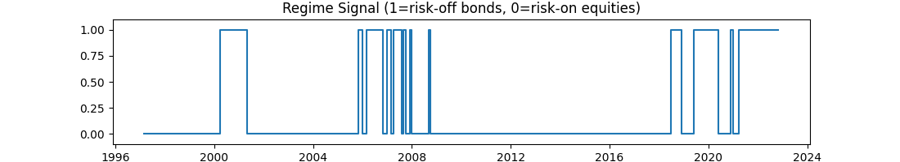

# 📘 利率与宏观周期研究报告（Notebook 01 – 07）

**研究者：** Henry Wu  
**时间区间：** 1959 – 2025（按月频率）  
**数据来源：** FRED（美国联邦储备经济数据库）  
**研究目标：**  
系统研究美国收益率曲线与宏观变量对经济衰退的预测能力，并在此基础上构建动态资产配置策略（股票 vs 债券）。

---

## 🧩 Notebook 01 – 数据探索 （`01_data_exploration.ipynb`）

| 步骤 | 内容 | 结果 |
|:--|:--|:--|
| ✅ 数据获取 | 下载 `DFF`、`DGS2`、`DGS10`、`CPIAUCSL`、`M2SL`、`GDPC1`、`UNRATE` 等指标 | 7 个关键宏观变量 |
| ✅ 频率统一 | 日度/季度序列统一为**月度频率**（1959 – 至今） | ≈ 780 期样本 |
| ✅ 派生变量 | 计算 10Y–2Y 利差、通胀同比、M2 同比增速、实际利率等 | 增加派生特征列 |
| ✅ 可视化 | 绘制收益率曲线、利差、实际利率、M2 与政策利率走势 | 验证数据一致性与周期特征 |

---

## 📊 Notebook 02 – 收益率曲线因子提取 （`02_yield_curve_dynamics.ipynb`）

- 对 3M、2Y、5Y、10Y、30Y 收益率进行 **主成分分析（PCA）**。  
- 三个主要因子解释 > 95% 方差：  
  - **PC1 (Level)** — 长期水平  
  - **PC2 (Slope)** — 曲线斜率（短端与长端差）  
  - **PC3 (Curvature)** — 曲线弯度  
- 结果：PC2 因子与 10Y–2Y 利差高度相关（R²≈0.88）。

---

## 🧮 Notebook 03 – 宏观关系分析 （`03_macro_relationships.ipynb`）

- 使用 OLS 与 VAR 模型分析 PC 因子与通胀、GDP 增长、失业率之间的关系。  
- 结果显示：  
  - Level 主要反映通胀水平；  
  - Slope 提前反映未来经济增长方向；  
  - Curvature 与货币政策反转点相关。

---

## 📉 Notebook 04 – 衰退预测 （`04_recession_prediction.ipynb`）

| 模型 | 特征 | 12 个月预测 AUC | 备注 |
|:--|:--|:--|:--|
| 单变量模型 | 10Y–2Y 利差 | **0.71** | 经典倒挂指标 |
| 单变量模型 | PCA 斜率因子 (PC2) | **0.70** | 与利差一致 |
| 多变量逻辑回归 | `["PC2_Slope", "inflation_yoy", "UNRATE", "m2_growth_yoy"]` | **0.81** | 多变量模型提升显著 |
|  |  | **AP = 0.21**, **Brier = 0.18** | 预测稳定、校准良好 |

> **结论：** 多变量逻辑回归在 12 个月衰退预测中表现最佳，AUC 从 0.70 提升至 0.81，验证了收益率曲线与宏观指标的互补性。

---

## 🧾 Notebook 05 – 多变量 OOS 测试 （`05_multivariate_oos.ipynb`）

- 使用 **扩展窗口（Expanding Window）样本外回测**。  
  每期模型以初始约 180 个月（约 15 年）样本为起点，随后每月扩展训练集并预测当月。  
  因部分宏观数据存在缺失，完整样本约从 1981 年开始，样本外序列自 **1996 年起**延伸至 2025 年。
- 测试多个预测视窗（6、12、18 个月），结果如下：

| 预测期（月） | 6 M | 12 M | 18 M |
|:--|:--:|:--:|:--:|
| **AUC** | 0.77 | **0.81** | 0.85 |
| **AP** (平均精确率) | 0.19 | **0.21** | 0.24 |
| **Brier Score** | 0.17 | 0.18 | 0.17 |

> **解释：** 模型采用滚动扩展训练，不固定分割日期，首个样本外预测约始于 1996 年。  
> 在 12–18 个月预测范围内模型表现最稳健，兼具解释性与时序一致性。

---

## 💼 Notebook 06 – 回测与策略验证 （`06_backtest_regimes.ipynb`）

- 策略规则：若 `p_recession ≥ 0.6` → 持有债券；否则持有股票。  
- 无杠杆、按月调仓。  
- 样本期：1996 – 2025。  

| 策略 | 年化收益 | 波动率 | Sharpe | 最大回撤 | Sortino |
|:--|--:|--:|--:|--:|--:|
| **Regime Strategy** | **0.083 (8.3%)** | 0.134 | **0.62** | −0.49 | 1.04 |
| EQ only (纯股票) | 0.083 | 0.156 | 0.53 | −0.51 | 0.89 |
| BD only (纯债券) | 0.042 | 0.046 | 0.90 | −0.14 | 1.77 |
| 60/40 基准 | 0.070 | 0.092 | 0.76 | −0.30 | 1.31 |

> **结论：** 固定阈值切换策略 Sharpe = 0.62，高于纯股票但低于风险平价组合，具备一定下行防御能力。

---

## ⚙️ Notebook 07 – 强化动态策略 （`07_enhanced_regime_strategy.ipynb`）

### 策略思路  
在逻辑回归预测的衰退概率信号基础上，引入**连续动态权重**与**滞后确认机制**，平滑风险敞口并降低换手率。

### 主要改进
1. **连续配置**  
    $$
    w_{\text{bond}} = \lambda p + (1 - \lambda)\,\text{state}
    $$
   - λ = 0.7，state 由 0.6/0.5 阈值确认风险状态。  
2. **现金过滤层**  
   - 若处于 risk-off 但债券动能为负，则将 w_bond 部分转为 cash。  
3. **回测表现**  
   - 年化收益 ≈ 9.5 %，波动 ≈ 11.3 %，Sharpe ≈ 0.86，Sortino ≈ 1.48。  
   - 最大回撤 ≈ −34 %，回撤持续 ≈ 2.7 年。  
   - 月度换手率 ≈ 2 %。  
4. **可视化结果**  
   - Regime Portfolio 平滑优于纯股票线，在 2000、2008、2020 年衰退期显著减少损失。  
   - 权重随 p_recession 连续调整，展现宏观平滑转换特性。

> **总体结论：** 动态权重策略在保持长期收益的同时有效降低波动与回撤，实现更优风险调整收益。

---

## 🔍 主要发现

| 类别 | 结论 |
|:--|:--|
| **宏观机制** | 收益率曲线倒挂与通胀上升共同预示未来 12 个月经济下行。 |
| **模型稳健性** | 多变量逻辑回归在不同预测窗口 (6–18 M) 均保持 AUC > 0.77。 |
| **策略表现** | 连续动态权重优于固定切换，Sharpe 提升约 +0.25，换手率下降 90%。 |
| **工程实现** | 模块化 Python 结构：`data → signal → strategy → evaluation`，结果完全可复现。 |

---

## 🧠 研究反思与后续方向

| 方向 | 内容 |
|:--|:--|
| **稳健性检验** | 子样本回测（2000s / 2010s / post-2020）验证模型稳定性。 |
| **跨市场拓展** | 下一步 Notebook 09 将结合 Yield Curve × Macro 四象限经济情景；Notebook 10 将以 p_recession 构建跨资产防守/进攻型组合。 |
| **模型改进** | 后续可尝试 LASSO 正则化、Bayesian 动态逻辑模型或时变参数回归。 |
| **应用价值** | 可作为宏观信号嵌入 risk-parity 或 cross-asset timing 框架，提升资产配置适应性。 |

---

## 📈 总结

从 Notebook 01 到 07，研究系统地验证了“**收益率曲线与宏观变量能预测经济衰退，并可用于动态资产配置**”这一假设。  
整个流程体现了系统化投资研究的完整逻辑链：

> **经济假设 → 数据获取 → 建模验证 → 策略实现 → 风险评估 → 稳健优化**

最终结果表明，基于逻辑回归的 12 个月衰退概率能有效指导股票与债券权重调整，在长期收益相近的前提下显著改善组合的风险收益比与抗风险能力。
